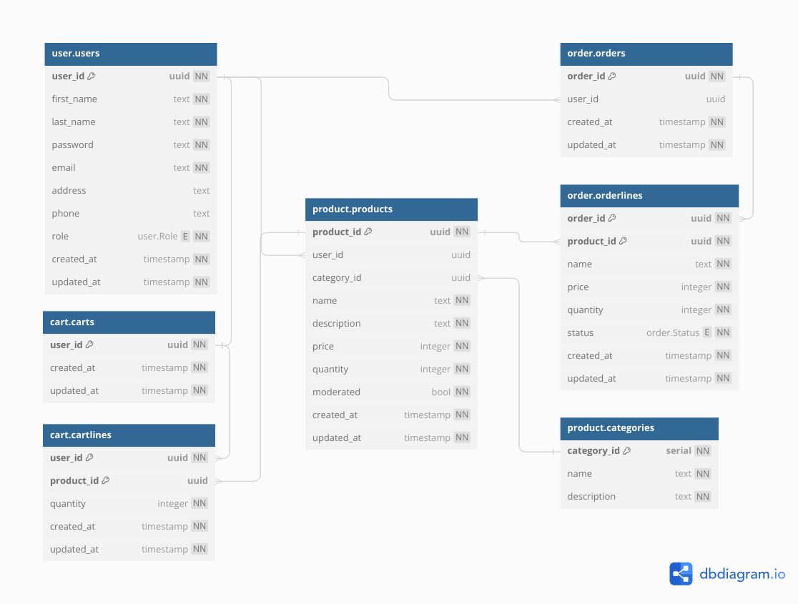

# Технический отчет

# Описание

## Наименование
**Go-Marketplace** - это название, отражающее использование языка программирования Go для создания проекта и основной идеи сервиса: торговли товарами между покупателями и продавцами. Сервис предоставляет платформу, где пользователи могут размещать свои товары, а также приобретать товары от других пользователей

## Предметная область
Основной целью сервиса является предоставление удобной и единообразной платформы для покупки и продажи товаров. Пользователи могут добавлять товары в корзину, формировать заказы, а продавцы выставлять свои товары с возможностью ограниченных предложений и снижения цен

Приложение разработано в микросервисной архитектуре с использованием протокола GRPC для взаимодействия между сервисами, также у каждого микросервиса есть своя база данных. Это обеспечивает простое горизонтальное масштабирование и изоляцию изменений в каждом сервисе

# Данные

## Пользователь
При регистрации пользователю необходимо указать:
- Имя
- Фамилию
- Уникальный Email
- Пароль

Внутри сервиса фиксируется информация о времени создания и времени изменения аккаунта пользователя, также есть разделение на роли и уровни доступа

### Дополнительные пользовательские данные
Пользователь может указать номер телефона и адрес для удобства взаимодействия

## Товар
При добавлении товара пользователь указывает его имя, описание и цену. В системе фиксируется время создания и обновления товара

## Корзина
Пользователи могут добавлять товары в корзину. Корзина автоматически очищается каждые 24 часа для предотвращения долговременного хранения товаров

## Заказ
Из корзины можно сформировать заказ, который содержит информацию о товаре, его количестве и статусе:
- Ожидает оплаты
- Доставка
- Доставлен

Покупатель может отменить заказ в любой момент

# Ограничения целостности

## Данные
- Пользователь: пароль должен быть более 8 символов, email должна быть уникальной и валидной, номер телефона должен быть валидным. Кроме того имя, фамилия и адрес пользователя не должны превышать 128 символов
- Товары: имя товара, описание до 128 символов, цена не может быть отрицательной

## Общие ограничения целостности
1. Валидация данных
2. Ограничения доступов для различных ролей

# Пользовательские роли
Внутри сервиса есть 4 роли (каждая следующая роль может все, что предыдущие):
- Visitor: может просматривать товары
- Registered user: может добавлять, редактировать и удалять свои товары, добавлять товары в корзину, просматривать и редактировать ее, также из корзины можно сформировать или отменить заказ
- Admin: может удалять любых пользователей и любые товары
- Product owner: может добавлять и удалять администраторов

# API
Пользователь взаимодействует с API Gateway по REST API или GRPC, далее gateway перенаправляет запросы на нужный микросервис или комбинирует запросы на разные микросервисы

Swagger Документация API находится в папке `docs/`

# Язык программирования
Go

# Технологии разработки
- [GRPC](https://github.com/grpc/grpc-go) - используется для серверной и клиентской частей каждого микросервиса
- [Mock](https://github.com/golang/mock) - используется для создания моков по интерфейсам
- [pgx](https://github.com/jackc/pgx) - драйвер для PostgreSQL
- [goose](https://github.com/pressly/goose) - утилита для миграций в PostgreSQL
- [go-redis](https://github.com/redis/go-redis) - клиент для работы с Redis
- [zerolog](https://github.com/rs/zerolog) - логгер
- [Docker](https://www.docker.com/) - средство контейнеризации и развёртывания приложения

# СУБД
- PostgreSQL - используется в сервисах user, cart, order, product
- Redis - используется в сервисах cart, product

## Схема базы данных
## PostgreSQL


## Redis
1. В сервисе для работы с корзиной используется для объектов `CartTask`
```go
{
	"cart_id": "123",
	"timestamp": 123
}
```
Которые хранятся в [Sorted Set](https://redis.io/docs/data-types/sorted-sets/), отсортированные по `timestamp`. Внутри сервиса работает worker, который получает все `CartTask` на текущее время и затем очищает сами корзины, хранящиеся в PostgreSQL, таким образом решается проблема с тем, что пользователь может слишком долго хранить товары внутри корзины

2. В сервисе для работы с продуктами используется для объектов `Discount`
```go
{
	"product_id": "123",
	"percent": 20,
	"created_at": 123,
	"ended_at": 456
}
```
Которые хранятся с определенным временем жизни равным `ended_at - created_at`, таким образом пользователь может создавать скидки на свои товары, которые будут действовать определенное время

# Тестирование
1. Unit тесты в слоях usecase и controller, где сосредоточена основная бизнес логика
2. Интеграционные тесты, проверяющие корректность работы каждого микросервиса по различным API запросам
